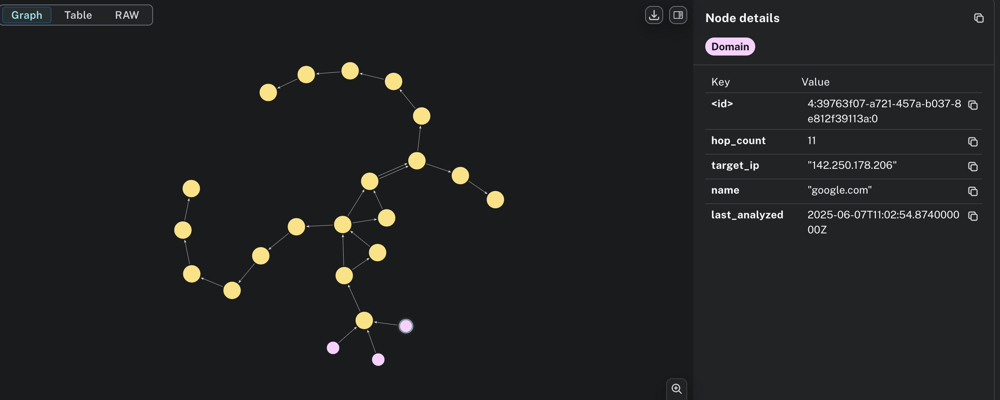
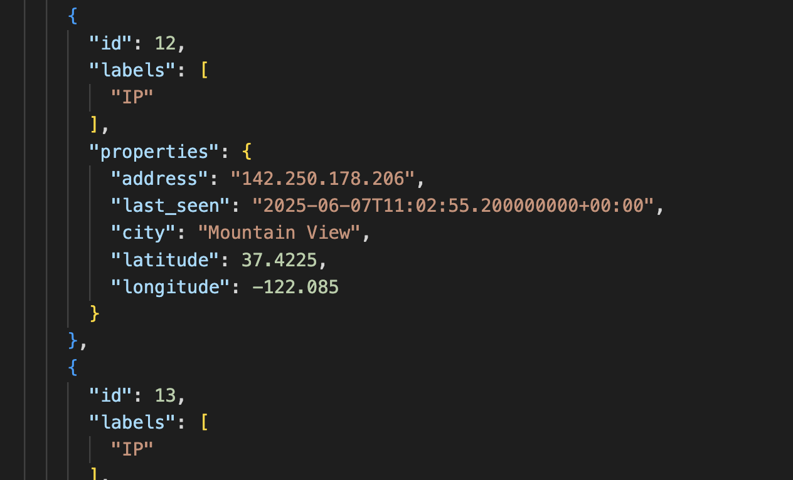
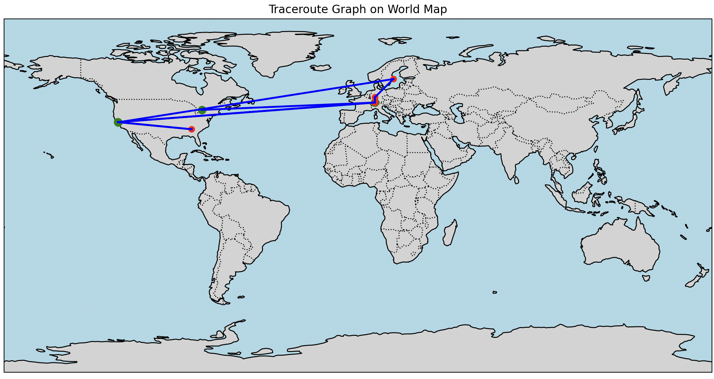
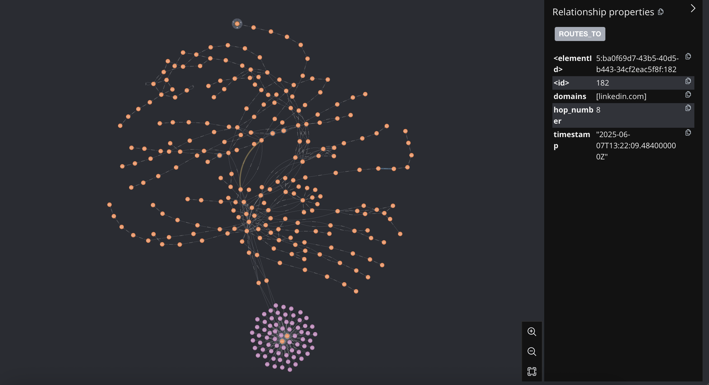

# InternetMapper

InternetMapper is a tool for visualizing and analyzing the network paths (traceroutes) from your machine to various domains. It automates DNS resolution, traceroute execution, geolocation lookup, and stores the results in a Neo4j graph database. The project also provides tools to export/import the graph data and visualize the global network paths on a world map.

## Features
- Automated DNS resolution and traceroute for multiple domains
- Geolocation lookup for each hop
- Storage of network paths in a Neo4j graph database
- Export and import of the entire graph database to/from JSON
- Visualization of network paths on a world map using Python (Cartopy/Matplotlib)

## Usage
- Analyze domains from the command line or from a file
- Export or import the graph database with a single command
- Visualize the traceroute graph using the provided analysis scripts

## Requirements
- Python 3.8+
- Neo4j database
- Poetry (https://python-poetry.org/)

## Poetry install library

1. Install dependencies:
   ```sh
   poetry install
   ```

## Example
1. Analyze domains:
   ```sh
   poetry run python main.py google.com facebook.com
   # or from a file:
   poetry run python main.py --domains-file domains.txt
   ```
2. Export the graph database:
   ```sh
   poetry run python main.py --export-db bak.json
   ```
3. Import the graph database:
   ```sh
   poetry run python main.py --import-db bak.json
   ```
4. Visualize the graph:
   ```sh
   poetry run python analysis/plot_graph.py bak.json
   ```

## Running Neo4j with Docker

You can quickly start a local Neo4j database using Docker:

```sh
docker run --publish 7474:7474 --publish 7687:7687 --env=NEO4J_AUTH=none neo4j
```

- This command runs Neo4j with authentication disabled for local development.
- The Neo4j browser will be available at http://localhost:7474.
- The Bolt protocol (used by the Python driver) will be available at bolt://localhost:7687.

## Example Outputs

Below are examples of what you can expect from this project

### 1. Graph Database Visualization
This is an example of the network graph as visualized in Neo4j



### 2. Raw Data Export/Import
The exported/imported data is in JSON format, containing all nodes and relationships:



### 3. World Map Plot
A world map showing the traceroute paths:



### 4. Graph Database Visualization 
A better example of a network graph:



## License
MIT License